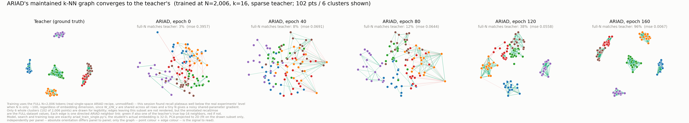
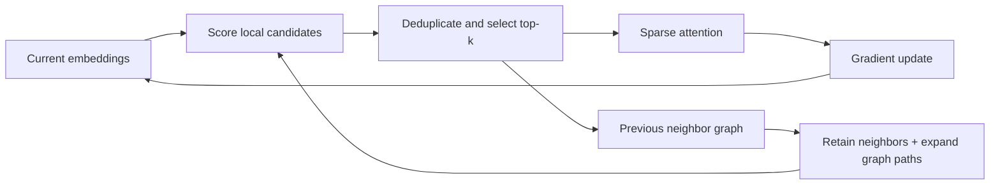
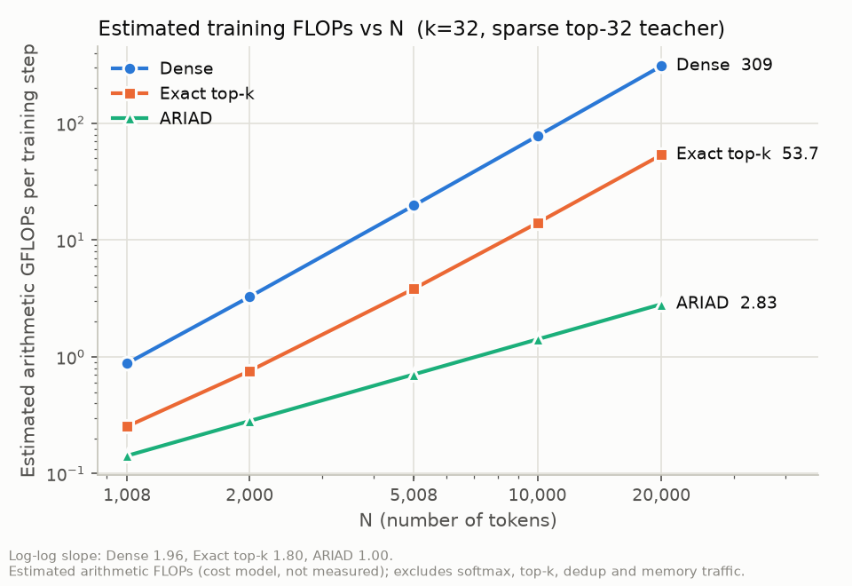
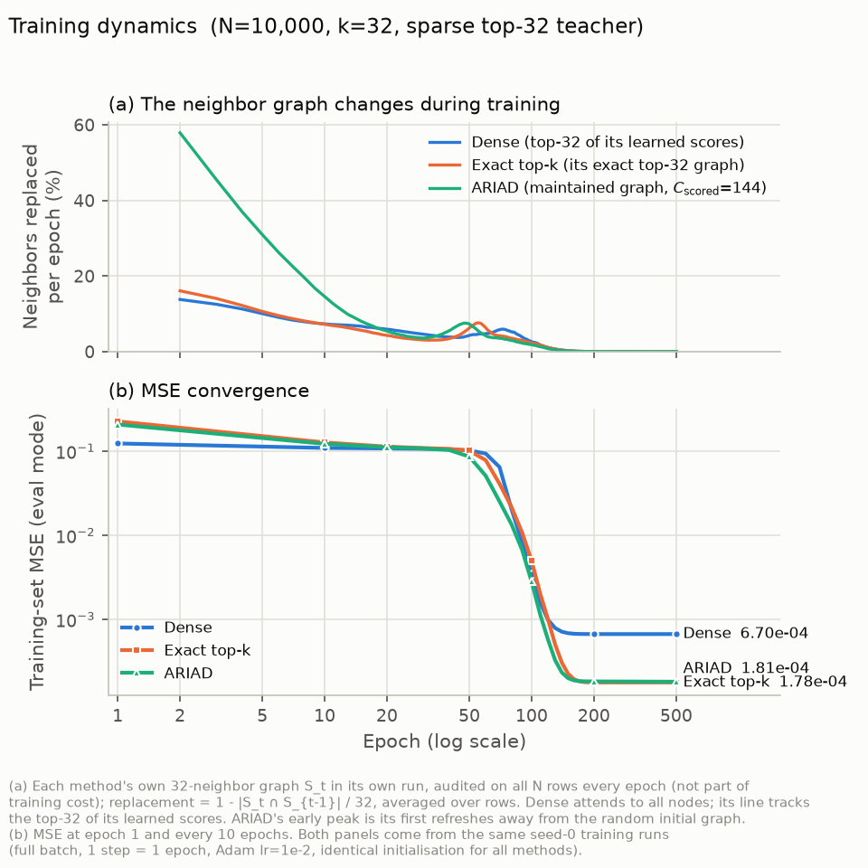
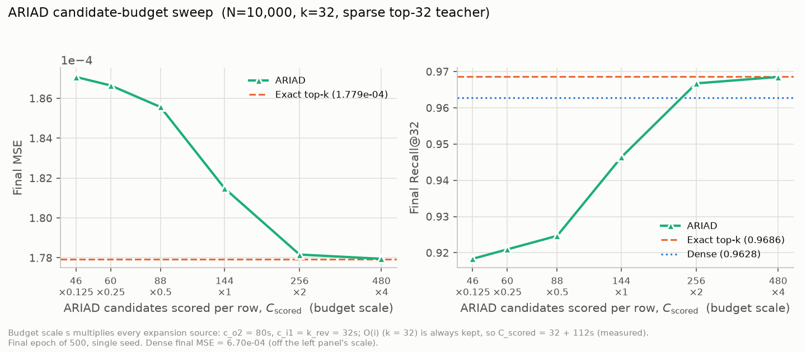
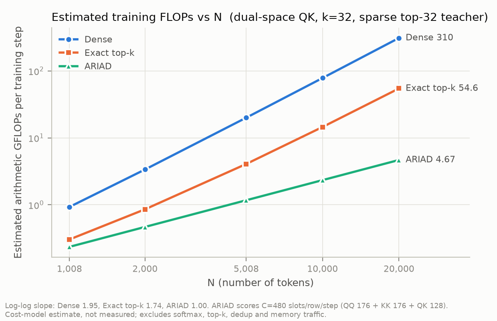
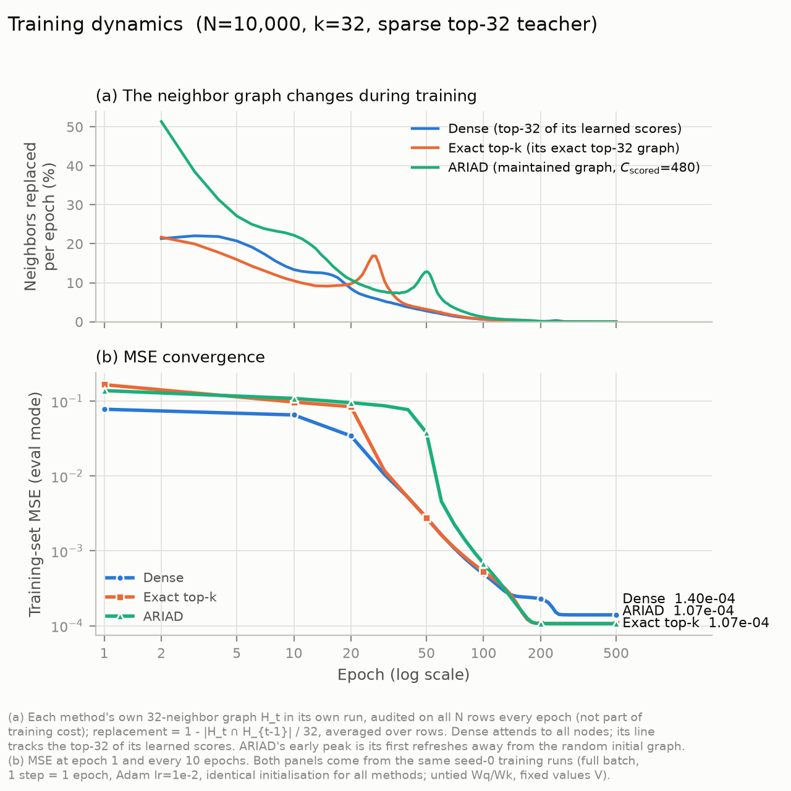

# ARIAD

**Online neighbor-graph maintenance for sparse attention with evolving embeddings.**

[](https://github.com/sjjgh/ARIAD/actions/workflows/tests.yml)
[](LICENSE)

[Method](docs/method.md) · [Experiments](#experimental-results) · [Reproduce](docs/reproducibility.md) · [Research text](docs/research/README.md)

## Learn the connections. Skip the exhaustive rebuild.



**From tangled connections to the teacher's neighborhood structure — with 96.8% fewer search-score evaluations.**

In this attention-like teacher–student task, ARIAD starts with a random neighbor
graph and learns from the teacher's output values, without being given the
teacher's edges. As the embeddings change, it keeps updating its k-NN graph
through local candidate search instead of rebuilding it by exhaustive all-pairs
search every epoch. By epoch 160, **teacher-neighbor match rises from about 3%
to 96%** across all 2,006 nodes.

| Work per training step | ARIAD / Exact top-k | Reduction |
|---|---:|---:|
| **Search-score evaluations** | **3.19%** | **96.8% fewer** |
| **Estimated total FLOPs** — projections + attention + search | **8.98%** | **91.0% less** |

*N=2,006, k=16, seed 0; 102 nodes shown, match measured over all nodes.
Green edges match the teacher; red edges do not. FLOPs are model estimates,
not measured speedups. This illustration uses a separate configuration from
the experimental sweeps below.*

[Figure setup and reproduction](ariad_single_space/highlight/README.md)
· [Cost calculation](ariad_single_space/highlight/cost_check.py)

> **Research status:** ARIAD is an ongoing research project. This release includes
> the current implementation and initial experimental results. Additional
> experiments and manuscript preparation are in progress.

ARIAD maintains a small neighbor graph as representations change during training.
Each step retains the current neighbors, proposes candidates through local graph
paths, and reranks them using the current embeddings. Sparse attention then runs
over the selected neighbors, with gradients through attention and projections.
Graph search runs without gradients and starts from random neighbors.

This repository contains a PyTorch research implementation, controlled
teacher–student experiments, paired Dense and Exact top-k baselines, raw results,
and scripts to regenerate the tables and figures. It includes both a shared
embedding-space variant and a variant with independently learned query/key spaces.

## Highlights

- **Bounded search per step:** the single-space experiment scores 144 candidate
  slots per node; the QK experiment scores 480 across three graphs.
- **Quality–cost tradeoff:** at 20,000 nodes, the QK experiment reaches the same
  displayed MSE as Exact top-k (0.52 × 10⁻⁴), with 2.4% of its search-score count
  and 8.5% of its estimated arithmetic cost.
- **Auditable evaluation:** three paired training seeds, retained CSV/JSON records,
  explicit teacher-match and current-graph-recall metrics, and a candidate-budget sweep.

The evidence is from synthetic, full-batch training-node evaluations. Arithmetic
costs are estimates, not measured wall-clock speedups. The two experimental
settings differ in teacher, data, value projection, and search budget.

## Quick start

Use Python 3.10 or newer and install the dependencies in a virtual environment.
The small demos run on CPU; experiment runners use CUDA when available.

```bash
git clone https://github.com/sjjgh/ARIAD.git
cd ARIAD
python -m venv .venv
# Linux/macOS:
source .venv/bin/activate
# Windows PowerShell: .venv\Scripts\Activate.ps1
python -m pip install -r requirements-dev.txt

python scripts/smoke.py --variant single
python scripts/smoke.py --variant qk
python -m pytest -q
```

Each demo executes three optimizer steps on a 256-node random input and checks
finite gradients, valid neighbor sets, and graph reuse in evaluation. It is an
integration example, not a reproduction of the reported quality results.

Generate every result table and figure from the committed records, without training:

```bash
python scripts/reproduce.py --suite figures
```

For a small end-to-end teacher–student run, including data generation:

```bash
python ariad_single_space/compare_dense_exact_ariad.py --n-clusters 8 --epochs 3 --seed 0 --teacher-dense 0
```

See [reproducibility](docs/reproducibility.md) for the full 500-step sweeps,
hardware considerations, output locations, and the tested environment.

## How it works



For a single space, candidates come from the current outgoing neighbors,
neighbors of those neighbors, and an incoming-edge buffer. The experiment uses
32 + 80 + 32 = **144 scored slots per row**, including duplicates and self-candidates
before masking. One graph is maintained; there are no replicas or periodic resets.

For independent Q/K spaces, ARIAD maintains **QQ**, **KK**, and **QK** graphs.
Within-space neighbors propose keys through key-side expansion and by sharing
keys found by similar queries. Only QK determines attention support. QQ and KK
each use 176 scored slots per row; QK uses 128, for **480 in total**.

With fixed dimensions and budgets, the modeled search work is O(NC) and sparse
attention work is O(Nk), compared with O(N²) exhaustive search. Data generation,
exact evaluation audits, and the Dense baseline still involve quadratic work.
See [method and implementation details](docs/method.md).

## Experimental results

Adapted from the author's experimental TeX, with original tables and figure
sources retained under [docs/research](docs/research/README.md).

Both settings use clustered synthetic geometry and independent Gaussian values,
128-dimensional standardized inputs, 64-dimensional projections, a sparse top-32
teacher, and 500 full-batch Adam steps (learning rate 0.01, no weight decay).
Each size uses one fixed dataset and three paired training seeds (0, 1, 2).
Reported MSE is measured after updates on the training nodes, not a held-out set.

### Single embedding space

The student learns both the shared query/key projection and the value projection.
Cluster jitter is 0.10; teacher logits use global off-diagonal standardization
and temperature 0.5. ARIAD uses 144 scored slots per node and attention width 32.

**Final MSE × 10⁻⁴, mean ± sample standard deviation over three training seeds.**
`<0.01` denotes a standard deviation below display precision.

| Nodes | Dense | Exact top-k | ARIAD |
|---:|---:|---:|---:|
| 1,008 | 4.49 ± 0.24 | 4.32 ± 0.07 | 4.36 ± 0.14 |
| 2,000 | 5.44 ± 0.09 | 4.79 ± <0.01 | 4.79 ± <0.01 |
| 5,008 | 4.15 ± 0.02 | 2.30 ± <0.01 | 2.31 ± <0.01 |
| 10,000 | 6.70 ± <0.01 | 1.78 ± <0.01 | 1.82 ± <0.01 |
| 20,000 | 11.85 ± <0.01 | 0.96 ± <0.01 | 1.11 ± <0.01 |

[Full table with teacher match](ariad_single_space/result/table1_mse_recall_sparse_k32_e500_seed0-1-2.md)
· [Per-seed values](ariad_single_space/result/table1_mse_recall_sparse_k32_e500_seed0-1-2_per_seed.csv)

At 2,000–10,000 nodes, the paired MSE increase over Exact is below 2.5% for every
seed. At 20,000 nodes, mean MSE increases by 15.6% using the displayed values,
and mean current-graph recall falls to 0.9336. A fixed candidate budget therefore
does not preserve retrieval accuracy at every scale. The 1,008-node runs are
still improving at step 500.



At 20,000 nodes, estimated costs are **309.17 / 53.66 / 2.83 GFLOPs per step**
for Dense / Exact / ARIAD. ARIAD uses 5.3% of Exact's estimate. These estimates
exclude indexing, memory traffic, top-k, softmax, deduplication, and audits.



At 10,000 nodes and seed 0, ARIAD reaches MSE 1.815 × 10⁻⁴ versus Exact's
1.779 × 10⁻⁴. Turnover measures each method's own graph trajectory; similar
turnover does not establish agreement between their neighbor sets.

### Candidate-budget tradeoff



At 10,000 nodes (seed 0), increasing scored slots from 46 to 480 improves
current-graph recall from **0.9286 to 0.9996**, while MSE decreases by about 4.9%.
At 256 slots, MSE is 1.782 × 10⁻⁴ versus Exact's 1.779 × 10⁻⁴, using 2.56% of
Exact's search-score count. The plot's original “Recall@32” label means
**teacher match**, not current-graph recall; its narrow MSE axis emphasizes
small differences. [Raw budget summary](ariad_single_space/budget_sweep_N10000_sparseT32_k32_e500_seed0_summary.csv).

### Independent query/key spaces

The student learns independent Q and K projections; its value projection is
**frozen to select the standardized value block of the input**. Cluster jitter
is 0.05 and teacher logits use dot products divided by √64, with temperature
0.01 and no global standardization. The three graphs use 480 search slots per node.

**Final MSE × 10⁻⁴, mean ± sample standard deviation over three training seeds.**

| Nodes | Dense | Exact top-k | ARIAD |
|---:|---:|---:|---:|
| 1,008 | 7.80 ± 0.02 | 7.81 ± 0.01 | 7.88 ± 0.03 |
| 2,000 | 5.31 ± 0.04 | 5.40 ± 0.08 | 5.45 ± 0.04 |
| 5,008 | 1.65 ± <0.01 | 1.52 ± <0.01 | 1.52 ± <0.01 |
| 10,000 | 1.40 ± <0.01 | 1.07 ± <0.01 | 1.07 ± <0.01 |
| 20,000 | 1.30 ± <0.01 | 0.52 ± <0.01 | 0.52 ± <0.01 |

[Full table](ariad_qk_space/result/table1.md)
· [Current-graph recall and paired differences](ariad_qk_space/result/table1_extra.md)
· [45 original run records](ariad_qk_space/result/raw)

For N ≥ 5,008, paired relative MSE differences from Exact are below 0.011% in
magnitude. Mean sampled current-graph recall ranges from 0.9961 to 0.9995.
At 20,000 nodes, teacher match is 0.9680 for ARIAD versus 0.9700 for Exact.



Estimated costs at 20,000 nodes are **310.15 / 54.64 / 4.67 GFLOPs per step**.
The supplied common accounting model treats all three projections as trainable,
although the experimental value projection is frozen. It overcounts value-related
backward work; it is not an implementation-exact operation count.



The seed-0 trajectory initially lags Exact and approaches the same final output
quality. It does not establish a general convergence-rate advantage.

### Reading the metrics

| Metric | Comparison |
|---|---|
| Teacher match@32 | Student neighbor set versus the teacher's top-32 set; Dense's set is diagnostic only |
| Current-graph recall@32 | Maintained ARIAD graph versus exact top-32 under that same student's current embeddings |
| Neighbor replacement | Each method's own consecutive neighbor sets |
| Estimated GFLOPs | An arithmetic cost model, excluding evaluation and irregular-memory overhead |

ARIAD evaluation reuses the graph selected before the optimizer update and scores
post-update embeddings, so current-graph recall includes one update of drift.
Single-space comparisons audit all rows; QK recall samples 1,000 query rows.

## Repository guide

```text
ariad_single_space/   Single-space search, attention, baselines, budget sweep, CSVs
ariad_qk_space/       QQ/KK/QK search, scaling sweep, JSON records and results
docs/                Method, reproduction guide, and original experimental TeX
scripts/             CPU demos and cross-platform reproduction entry point
tests/               Integration checks for both attention variants
.github/workflows/   CPU tests and result-regeneration CI
```

## Scope and next steps

This is a research reference implementation for a fixed set of nodes evolving
during full-batch training. It is not a drop-in causal or batched Transformer
attention kernel. Results do not establish natural-data generalization or
end-to-end acceleration. The sparse teacher structurally favors sparse students;
Dense's errors do not imply an unavoidable dense-attention error floor.

The QK experiment uses fixed values and a larger search budget; its stronger
agreement with Exact cannot be attributed to the dual-space design alone.
Useful next experiments include multiple dataset seeds, real-data tasks,
learned-value QK evaluation, a QK budget sweep, and hardware profiling.
See [implementation boundaries](docs/method.md#implementation-boundaries).

## License and attribution

Released under the [MIT License](LICENSE). If you build on this work, link to
this repository and record the commit used for your experiments. The research
text is an experimental write-up; no conference acceptance or publication is
claimed. Contributions are welcome; see [CONTRIBUTING.md](CONTRIBUTING.md).
